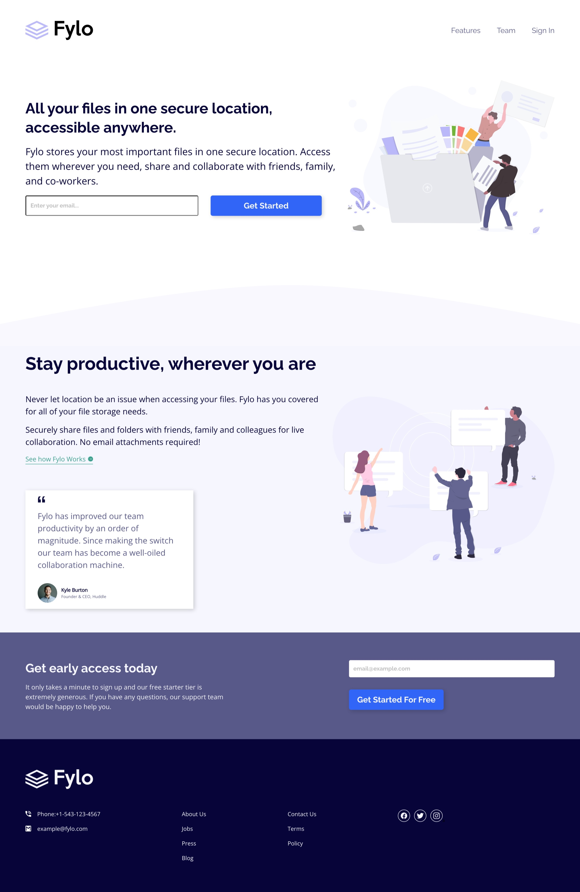
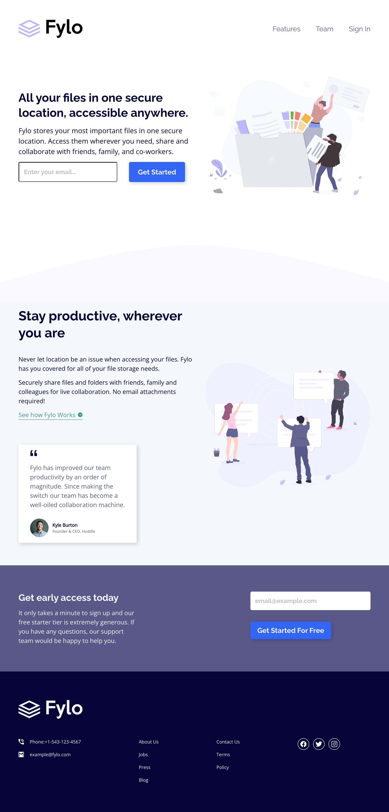
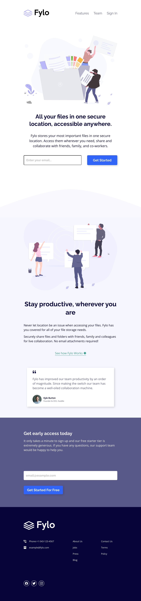
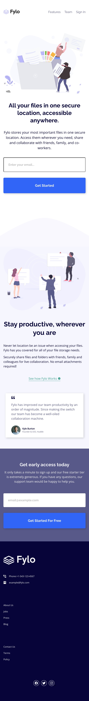

# Technical Documentation Of Project

## Table of contents

- [Overview](#overview)
  - [The challenge](#the-challenge)
  - [Screenshot](#screenshot)
  - [Links](#links)
- [My process](#my-process)
  - [Built with](#built-with)
  - [What I learned](#what-i-learned)
  - [Continued development](#continued-development)
  - [Useful resources](#useful-resources)
- [Author](#author)
- [Acknowledgments](#acknowledgments)

## Overview

### The Challenge

The challenge which was done, the users would be able to:

- View the optimal layout for the site depending on their device's screen size.
- See hover states for all interactive elements on the page.

### Screenshots

I made screenshots available for how the landing page would look on mobile, tablets, laptops and Desktop device. The images can all be seen below:



_The image above shows the desktop view of the landing page._



_The image above shows the laptop view of the landing page._



_The image above shows the tablet view of the landing page._



_The image above shows the mobile view of the landing page._

## Links

The solution and the live url can be seen as provided below:

- Solution URL: [View Solution URL here](https://github.com/salutDami/Fylo-Landing-Page)
- Live Site URL: [Add live site URL here](https://salutdami.github.io/Fylo-Landing-Page/)

## My process

### Built with

- Semantic HTML5 markup
- CSS custom properties
- Flexbox
- Desktop-first workflow

### What I learned

I really enjoyed this project alot, as it helped get a much more better undestanding of using flexbox to make page layouts as that was my aim of taking up this project. I got to see how the the flex-item properties and the flex-container properties can be use to make layouts appear good on a landing page.

I got to practice how to use CSS csutom properties as I figured when doing the project that it helps speed up my work flow when coding, solving problems and carrying out more challenges. The use of pseudo classes also cam in handy when displaying the error message for the the input form. This trick was fun to figure out and learn.

I have provided a few code snipptes to show below to show how I was able to implement some of the news things I learned:

-Using The CSS Pseudo Class _invalid_

```html
<form class="cta_form cta_form_sign_up" name="Registration Form">
  <label for="email" class="sr-only">Enter your Email</label>
  <input
    type="email"
    name="email"
    id="email"
    placeholder="email@example.com"
    class="input_email  input_email_sign_up"
  />
  <span
    class="email_error_message error_message_color"
    role="error meassage"
    aria-label="Please check your email"
  ></span>
  <button class="btn sign_up_btn" type="button">Get Started For Free</button>
</form>
```

```css
.input_email_sign_up {
  border: none;
}

.input_email_sign_up:invalid + .email_error_message::after {
  content: "Please check your email";
  display: inline-block;
  position: absolute;
  color: var(--light-grayish-blue);
  bottom: 45%;
  left: 0%;
  font-size: var(--fs-3);
}

.input_email_sign_up:focus + .email_error_message::after {
  content: "";
  display: inline-block;
  position: absolute;
  bottom: 0%;
  left: 0%;
}

.input_email_sign_up {
  flex-grow: 0.5;
}
```

- Using The Custom Properties

```css
root {
  /* Colors */
  --very-dark-blue: hsl(243, 87%, 12%);
  --desaturated-blue: hsl(238, 22%, 44%);
  --bright-blue: hsl(224, 93%, 58%);
  --moderate-cyan: hsl(170, 45%, 43%);
  --light-grayish-blue: hsl(240, 80%, 98%);
  --light-gray: hsl(0, 0%, 75%);
  --light-red: hsl(0, 100%, 63%);
  --light-moderate-cyan: #76bcb0;
  --light-bright-blue: hsl(224, 87%, 70%);
  --black: hsl(0, 56%, 2%);
  --white: hsl(0, 0%, 100%);

```

### Continued development

For my continued development, I would still want to use flexbox to do more projects and make use of the flexbox properties as more projects are done. The use of media queries could still improve in terms of selecting brake points as I struggled with that in some way.

### Useful resources

I would like to provide some very useful resources that helped me do this project.

- [w3schools.com](https://www.w3schools.com) - This website was where I was able to learn the flex-box properties I used in carrying out this project.
- [box-shadow.dev](https://box-shadow.dev/) - This helped me in picking the box shadow for this project on he buttons.

## Author

- Linkedin- [Ikuomola Stephen](https://www.linkedin.com/in/ikuomola-stephen/)
- Frontend Mentor - [@salutDami](https://www.frontendmentor.io/profile/salutDami)
- Twitter - [@\_salutDami](https://www.twitter.com/_salutDami)
